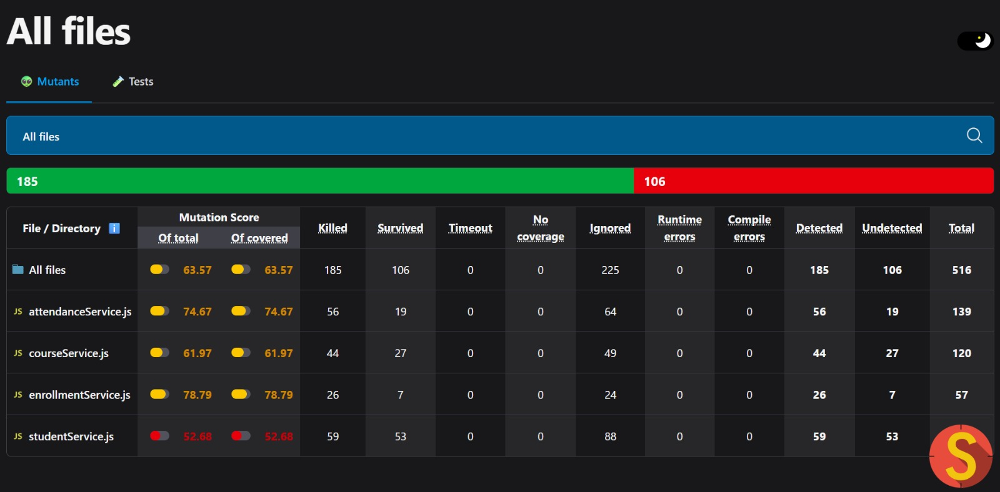
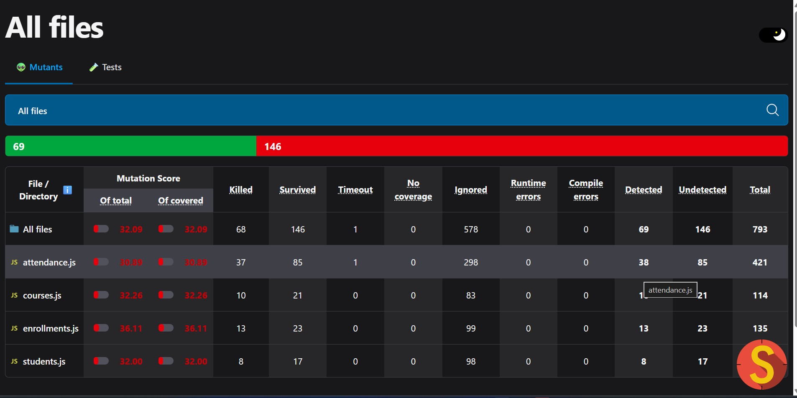

CSE731 – SOFTWARE TESTING (IIIT Bangalore)

MT2024032 - Bhavya Rajeev Joshi

MT2024043 - Dhruvik Patel

--------------------------------------------------------
Repository: https://github.com/bhavya28122251/Software_Testing

Project Description
----------------------------
This project implements and evaluates mutation testing on a Student Management System backend built with Node.js, Express, SQLite and Knex. We developed unit and integration tests (Mocha, Chai, Supertest) and used Stryker Mutator to measure test strength at unit and integration levels. The system contains functional modules for Students, Courses, Attendance and Enrollments.

Student Management System:
------------------------------
The Student Management System manages core academic operations, including handling students, courses, enrollments, and attendance records.
It allows creating, updating, and retrieving data securely through REST APIs.
The system ensures proper validation, normalization, and structured data flow between services.
Overall, it provides an organized and efficient backend for managing academic records and interactions.

Test Case Strategy Used
--------------------------
- Mutation Testing — design tests to kill mutants at unit and integration levels.
- Integration Testing — API-level tests that exercise route handlers, services and DB together.
- Unit Testing — service-level tests focusing on business logic and validation.
- Boundary Value & Error-based Testing — included as part of integration tests (invalid inputs, DB-error paths).

Mutation Operators Used
--------------------------
Unit-Level:
1. BooleanSubstitution       — flip boolean expressions (true ↔ false)
2. LogicalOperator           — change && ↔ || and similar logical ops
3. EqualityOperator         — mutate ===, !==, >, < etc.
4. ConditionalBoundary       — alter >=, >, <=, < to expose off-by-one
5. StringLiteral            — change constant string values
6. BlockStatement           — remove or alter whole code blocks (if/try bodies)

Integration-Level:
1. LogicalOperator
2. EqualityOperator
3. ObjectLiteral / ArrayLiteral (mutate returned or parameter objects/arrays)
4. CallExpression (mutate function calls / arguments)
5. ReturnStatement (change returned values)
6. ThrowStatement (add/remove thrown errors)

Strong vs Weak Mutants 
---------------------------------
- Strong Mutants: killed when a test causes a visible difference in program output or behavior (Stryker uses this).
- Weak Mutants: killed if internal state changes even when final output does not change (not used here).
Our project uses Stryker's strong mutation mode; mutants are evaluated by observing externally visible behavior changes.

Files Mutated by Stryker
---------------------------
- Unit-level mutation set: Files under `services/**/*.js` are mutated (configured in stryker.conf.js)
- Integration-level mutation: Files under 'routes/**/*.js' are mutated (configured in stryker.integration.conf.js)

Test Files 
-------------------------------
Integration tests:
- test/integration/attendance.test.js
- test/integration/courses.test.js
- test/integration/students.test.js
- test/integration/enrollment.test.js

Unit tests :
- test/unit/studentService.test.js
- test/unit/courseService.test.js
- test/unit/attendanceService.test.js
- test/unit/enrollmentService.test.js

Test Results 
--------------------------
UNIT MUTATION TESTING RESULTS

Overall Unit Mutation Score: 63.57%

Total Mutants Killed: 185

Total Mutants Survived: 106

INTEGRATION MUTATION TESTING RESULTS

Overall Unit Mutation Score: 32.09%

Total Mutants Killed: 68

Total Mutants Survived: 146

Ananlysis
-------------------------------------------
- Unit mutation testing shows a moderately strong score of 63.57%, meaning most core logic is covered but several edge cases remain untested.
- Integration mutation testing is much weaker at 32.09%, indicating that many route-level conditions and error branches are not exercised by the API tests.

Conclusion
-----------------------------------------
For the Student Management System, mutation testing helped measure how effectively the tests validated core features such as student records, courses, enrollments, and attendance handling.
The higher unit mutation score indicates strong coverage of business logic and data-processing functions, while the lower integration score shows that several route-level validations, error cases, and boundary conditions are still not fully exercised.
Overall, mutation testing revealed important improvement areas in API-level robustness and ensured that the system’s critical academic workflows are tested more thoroughly and reliably.

Team contributions
-----------------------------------------------
Bhavya Rajeev Joshi : MT2024032
- Integration test done on attendance.js and courses.js
- Unit Testing done on attendanceService.js and courceService.js

Dhruvik Patel : MT2024043
- Unit tests done studentService.js and enrollmentService.js
- Integration Testing done on student.js and cources.js

AI Tool disclosure
---------------------------------
We used ChatGPT for:
- Drafting documentation and README
- Suggestions for test improvements and Stryker config
- used for getting help with source code

